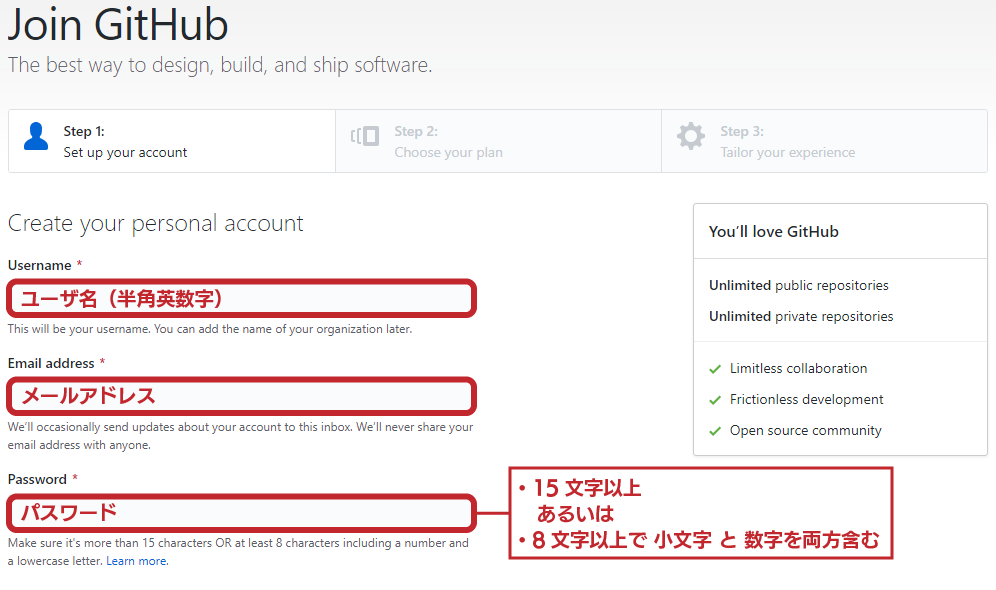
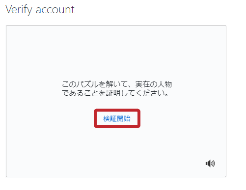
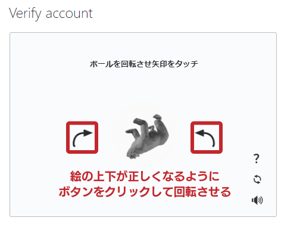
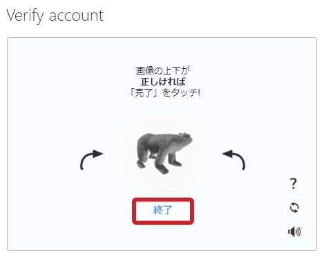
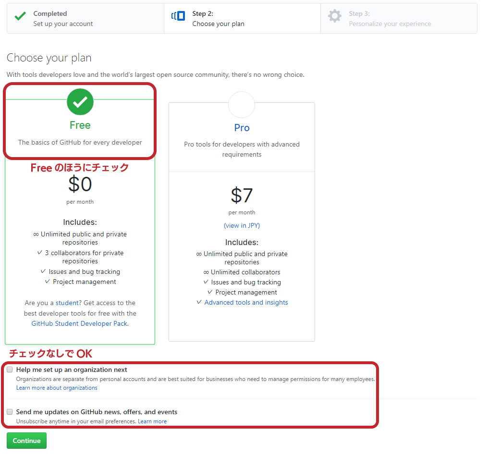
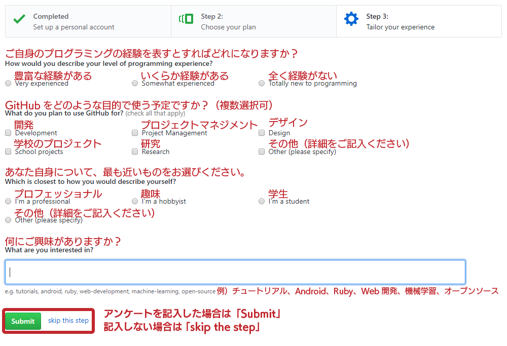
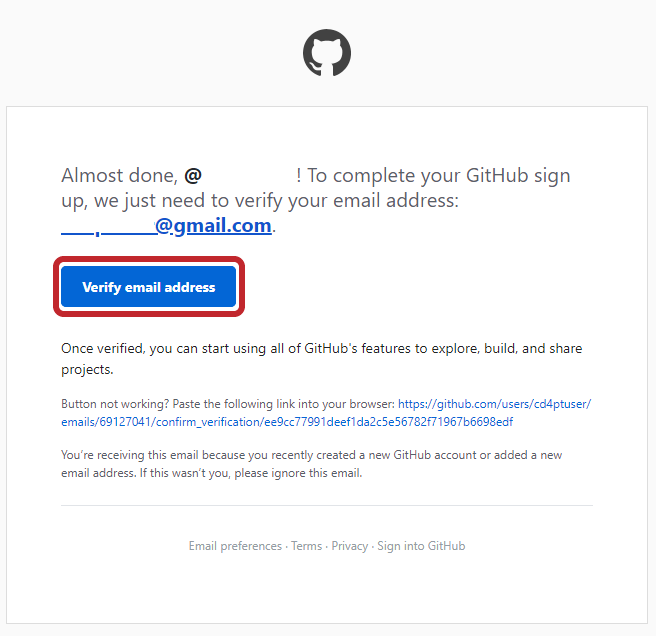
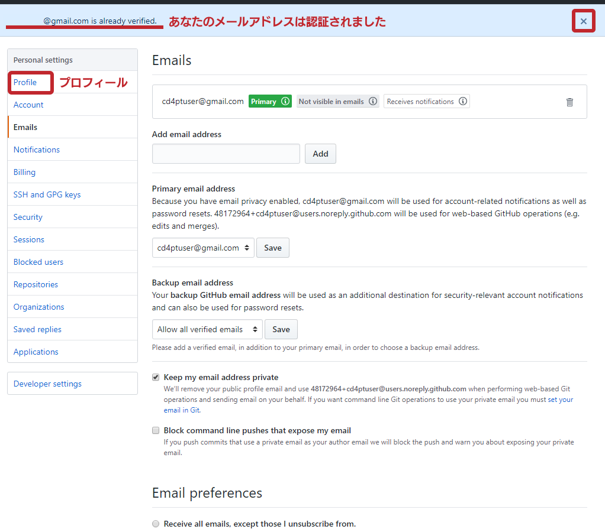
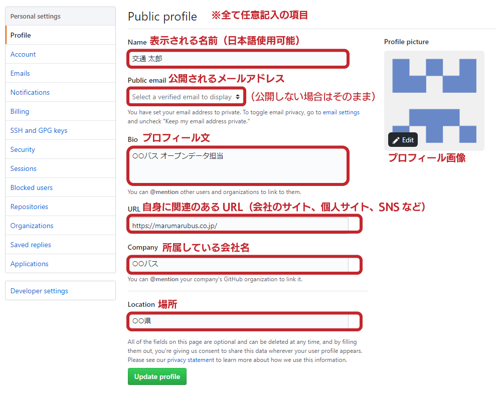
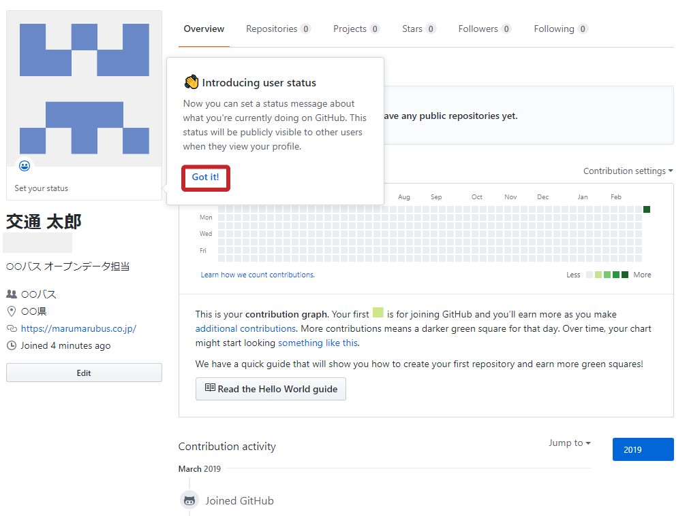

# GitHubへの登録・プロフィールの作成

所要時間 3分～5分

## 1. ページ右上の「Sign up」をクリック

## 2. Join GitHub ページで必要事項を入力

### 2.1. ユーザ名・メールアドレス・パスワードを入力

パスワードは文字数に指定があるので要注意です。

### 2.2. パズルを解いて人間かどうかのチェックを受ける 

ロボットによる自動登録を防ぐための部分です。簡単なパズルを解いてください。

#### 「検証開始」をクリック

#### 絵の上下が正しくなるようにボタンをクリック

#### 完了したら「終了」をクリック

緑色の **Continue** ボタンをクリックして次に進んでください。

## 3. プランを選択

無料プランである「Free」にチェックを入れてください。 
「Help me set up an organization next」および「Send me update on GitHub news」のチェックは入れなくて大丈夫です。 
完了したら **Continue** ボタンをクリックしてください。

## 4. アンケート（任意）を記入

アンケートを記入する画面です。記入したくなければ **skip the step** をクリックして構いません。

## 5. 確認メールを開いてメールアドレスを認証

先程記入したアドレスにメールが届くはずです。
**Veryfi email address** をクリックします

## 6. メールアドレスが確認されたらプロフィールを記入

Profile をクリックします。

## 7. プロフィールを記入

以下の画像を参考に記入してください。**Update Profile**をクリックするとプロフィールが更新されます。

## 8. プロフィールを開いて確認

view your profile をクリックして反映されたか確認しましょう。

"Introducing user status" というメッセージは Got it をクリックして閉じて構いません。

これでプロフィールの作成まで完了しました。